## Geografia

::: {style="font-size: 164%;line-height: 164%;"}
1. «nauka badająca powłokę Ziemi, jej przestrzenne zróżnicowanie pod względem przyrodniczym i społeczno-gospodarczym»
2. «wydział lub kierunek na wyższej uczelni zajmujący się tą nauką»
3. «nauka geografii jako przedmiot w szkole; też: lekcja tego przedmiotu»
4. «rozkład, rozmieszczenie elementów w obrębie jakiegoś zjawiska»
:::

::: aside
<https://sjp.pwn.pl/slowniki/geografia.html>
:::

## Geografia: od opisu świata do eksploracji

:::: {.columns}
::: {.column width="35%"}
Babilonia: Babilońska mapa świata (*Imago Mundi*, ~VIII wiek p.n.e.)
```{r}
#| out-width: 90%
#| fig-cap: "<https://en.wikipedia.org/wiki/Babylonian_Map_of_the_World>"

```
:::
::: {.column width="65%"}
Starożytna Grecja: 
*Rekonstrukcja świata z opisów Herodota (V wiek p.n.e.)*
```{r}
#| out-width: 45%
#| fig-cap: "<https://pl.wikipedia.org/wiki/Herodot>"
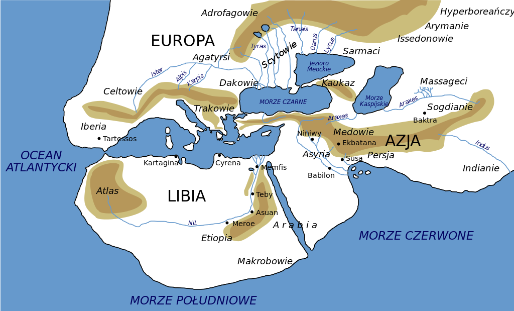
```
```{r}
#| out-width: 75%
#| fig-cap: "<https://en.wikipedia.org/wiki/Age_of_Discovery>"
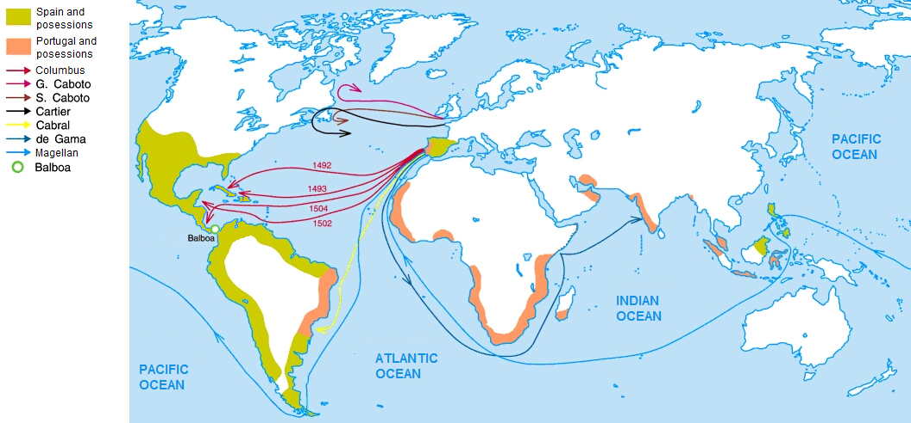
```
:::
::::

<!-- Geografia zaczynała jako opis i odkrywanie świata; z czasem coraz bardziej przesuwała się w stronę systematycznej wiedzy o zróżnicowaniu przestrzennym. -->

## Geografia: profesjonalizacja i instytucje

Zapotrzebowanie na wiedzę geograficzną wzrastało, co wymagało przygotowania nauczycieli, instytucji i nowych metod opisu świata.

:::: {.columns}
::: {.column width="30%"}
```{r}
#| out-width: 30%
#| fig-cap: "Royal Geographical Society (1830)"

```
```{r}
#| out-width: 100%
#| fig-cap: "Lekcja geografii (koniec XIX wieku, Kijów), <https://www.encyclopediaofukraine.com>"
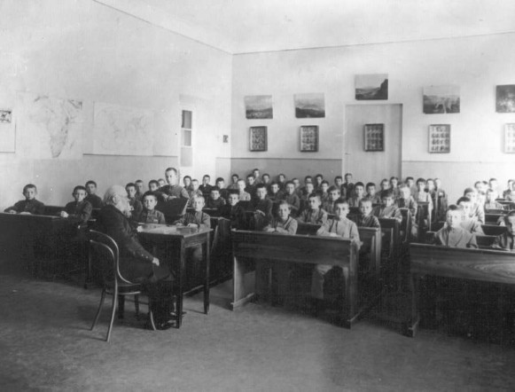
```
:::
::: {.column width="65%"}
```{r}
#| out-width: 100%
#| fig-cap: "Wyprawa Amundsena na biegun południowy (1911)"
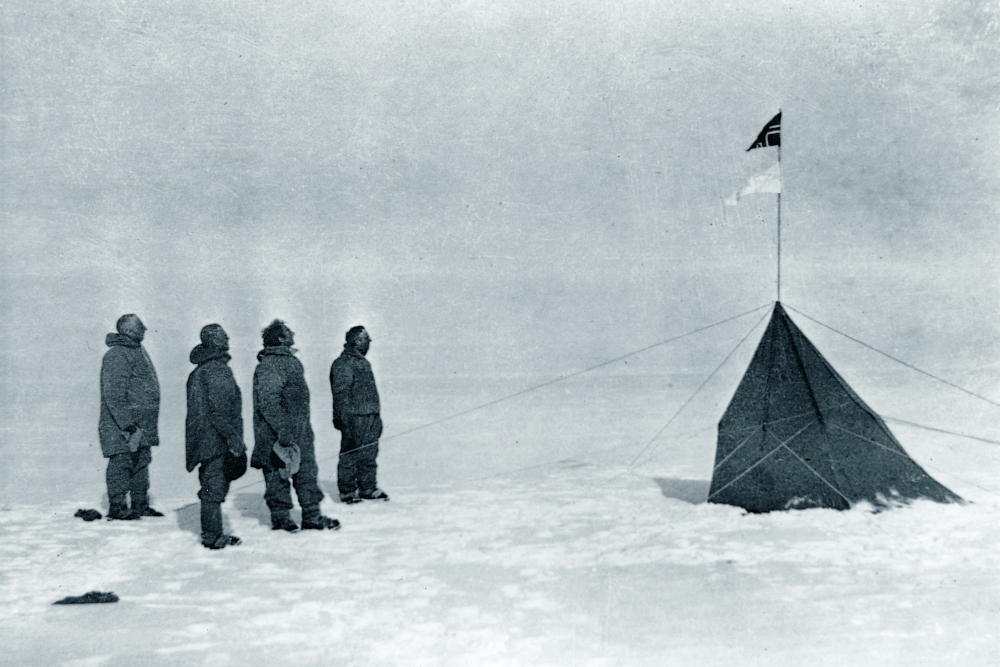
```
:::
::::

<!-- Geografia staje się zinstytucjonalizowaną dyscypliną: szkolną, akademicką i badawczą. -->

## Kryzys tożsamości geografii

- Utrata dotychczasowej podstawowej funkcji poznawczej, polegającej na rozszerzaniu tzw. horyzontu geograficznego
- Wyzwania w zdefiniowaniu celu i zakresu geografii
- Rozdział między geografami fizycznymi (środowisko) a geografami człowieka/społeczno-ekonomicznymi (społeczeństwo)

:::: {.columns}
::: {.column width="35%" .fragment}
<br><br><br><br><br><br><br><br><br>
*Inne:*

- *Zróżnicowanie geograficzne geografii*
- *Rozdrobnienie i specjalizacja*
- *Coraz większa rozbieżność między geografią szkolną a akademicką*

:::
::: {.column width="65%"}
```{r}
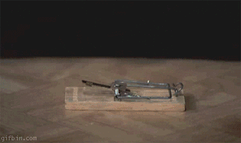
```
:::
::::

## Współczesna geografia

Geografia dziś nie polega na zapamiętywaniu nazw i lokalizacji, ani na tworzeniu map.

Jej celem jest rozumienie **zjawisk przestrzennych**: tego, **co** znajduje się **gdzie**, **dlaczego właśnie tam** i **jak to się zmienia**.

```{r}
#| out-width: 110%
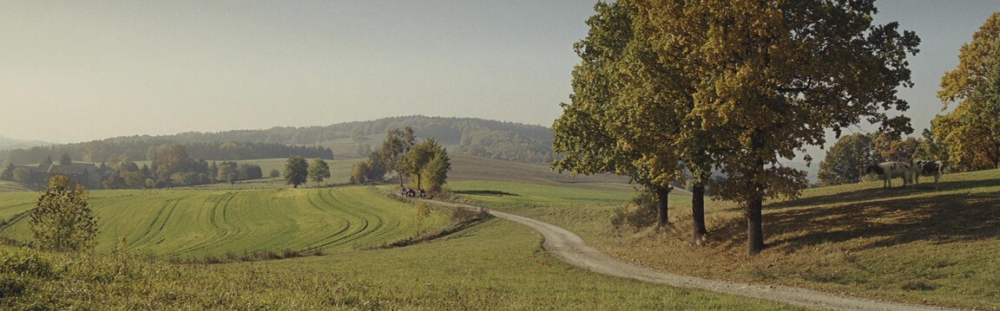
```

:::: {.columns}
::: {.column width="55%"}
**Przykładowe współczesne kierunki badań:**

- modelowanie zmian klimatu i bioróżnorodności
- analiza miast i mobilności
- teledetekcja satelitarna i monitorowanie środowiska

:::
::: {.column width="45%"}
::: {.incremental}
Geografia:

- stawia pytania badawcze i testuje hipotezy
- korzysta z danych terenowych, satelitarnych i społecznych
- używa metod ilościowych, modeli i algorytmów
- coraz silniej łączy geografię z fizyką, chemią, **matematyką**, statystyką i informatyką
:::
:::
::::


# Dane przestrzenne {data-background-image="figs/cover.png" data-background-opacity="0.3"}

## Skąd się biorą dane przestrzenne?

:::: {.columns}
::: {.column width="30%"}
```{r}
#| fig-cap: "[https://www.esa.int](https://www.esa.int/Applications/Observing_the_Earth/Meteorological_missions/meteosat_third_generation/New_weather_satellite_reveals_spectacular_images_of_Earth); <http://zbip-lwem.home.amu.edu.pl/>"
#| fig-align: center
#| out-width: 80%
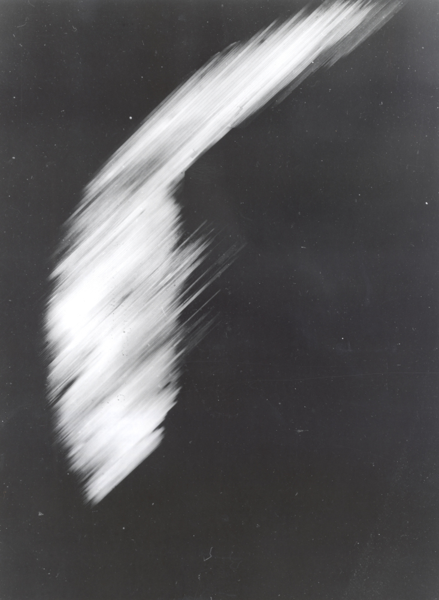
```

:::
::: {.column width="70%"}
```{r}
#| fig-align: center
#| out-width: 60%
knitr::include_graphics("figs/data-earth.gif")
```

```{r}
#| fig-align: center
#| out-width: 60%
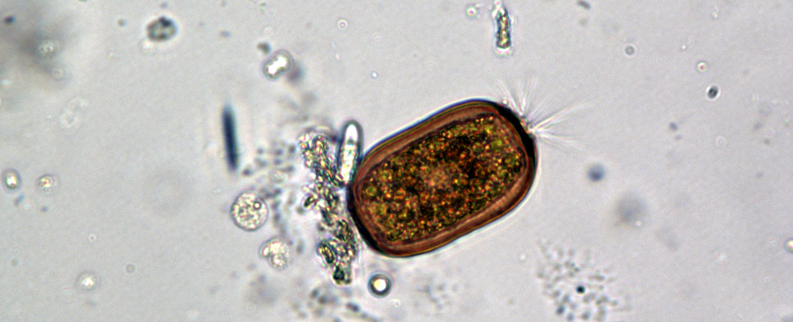
```
:::
::::

Współczesna geografia korzysta z bardzo różnych źródeł danych — od obserwacji satelitarnych po pomiary bezpośrednie w terenie.

## Teledetekcja

:::: {.columns}
::: {.column width="50%"}
```{r}
#| fig-align: center
#| out-width: 60%
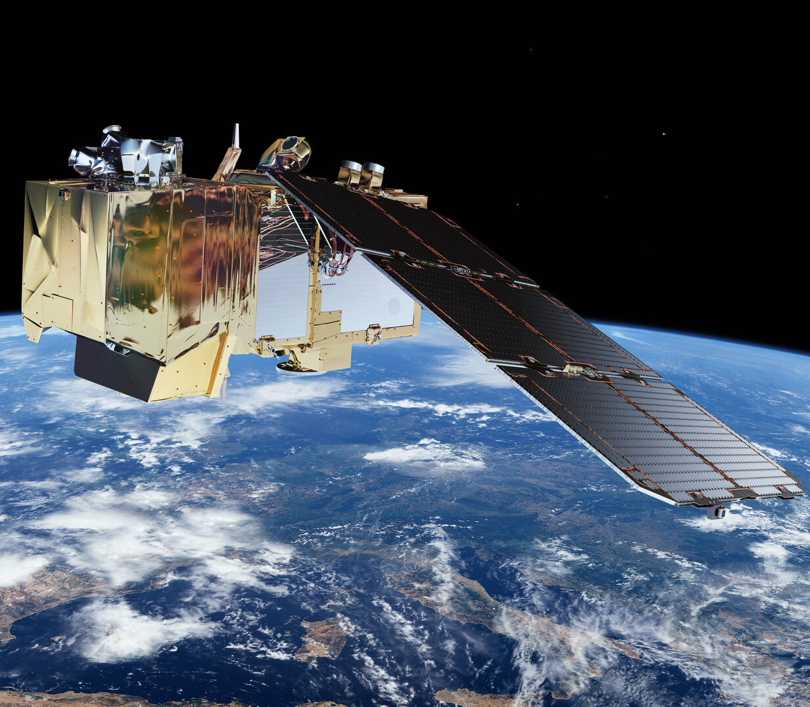
```
*Misje satelitarne:* Landsat, MODIS, Sentinel, itd.

*Typ misji:* publiczna/komercyjna

*Typ sensora:* pasywny/aktywny

*Typ danych:* optyczne/radarowe, itd.

*Rozdzielczość:* przestrzenna/czasowa/spektralna
:::
::: {.column width="50%"}
```{r}
#| fig-align: center
#| out-width: 55%
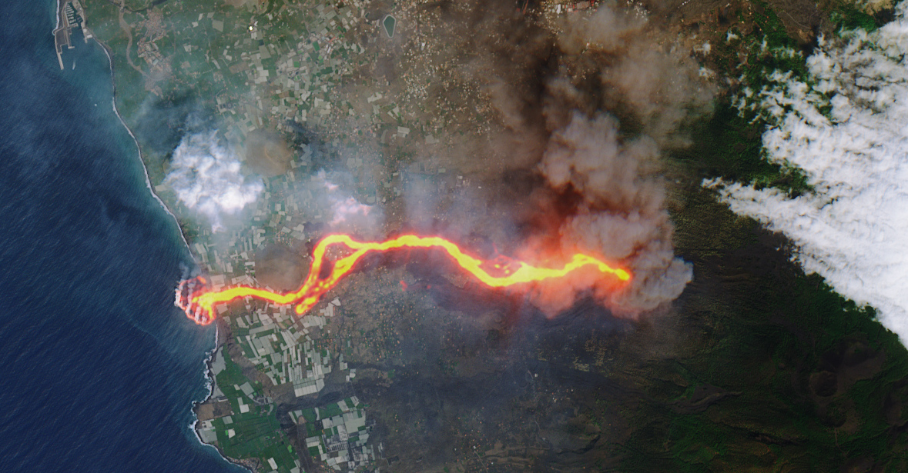
```
```{r}
#| fig-cap: "<https://en.wikipedia.org/wiki/Sentinel-1>, <https://en.wikipedia.org/wiki/Sentinel-2>"
#| fig-align: center
#| out-width: 55%
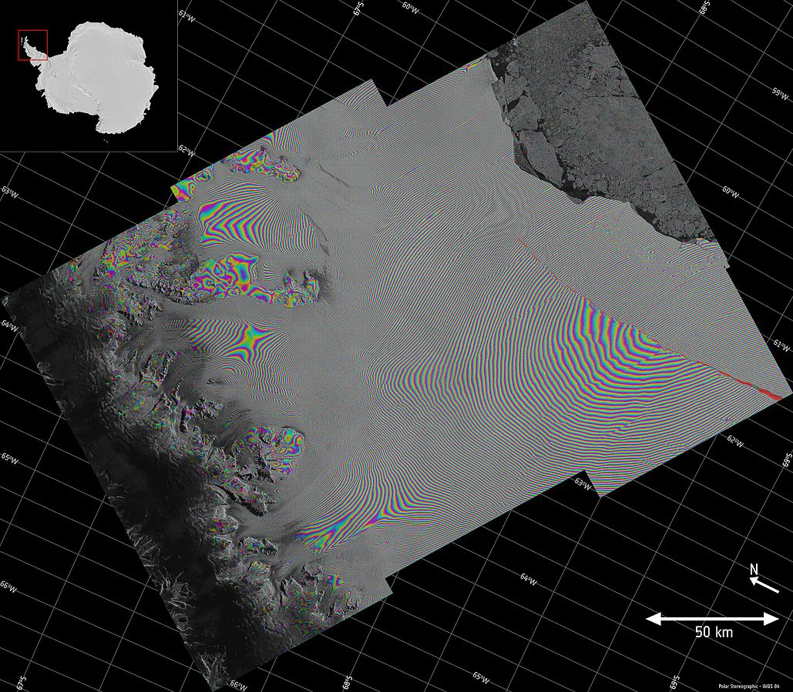
```
:::
::::

*Teledetekcja daje wiele możliwości, ale zwykle mierzy **proxy** zjawisk, a nie samo zjawisko bezpośrednio.*

## Teledetekcja

::: {.r-stack}
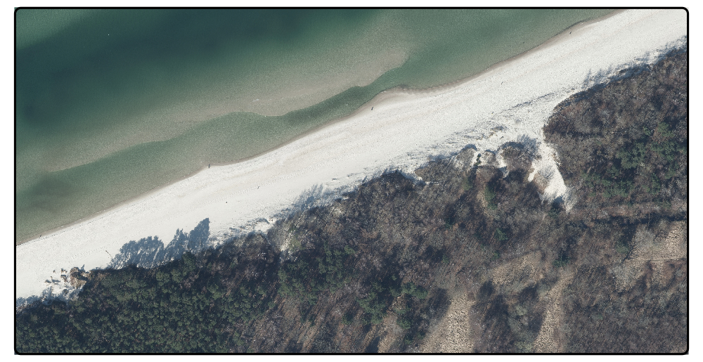{width="1500"}

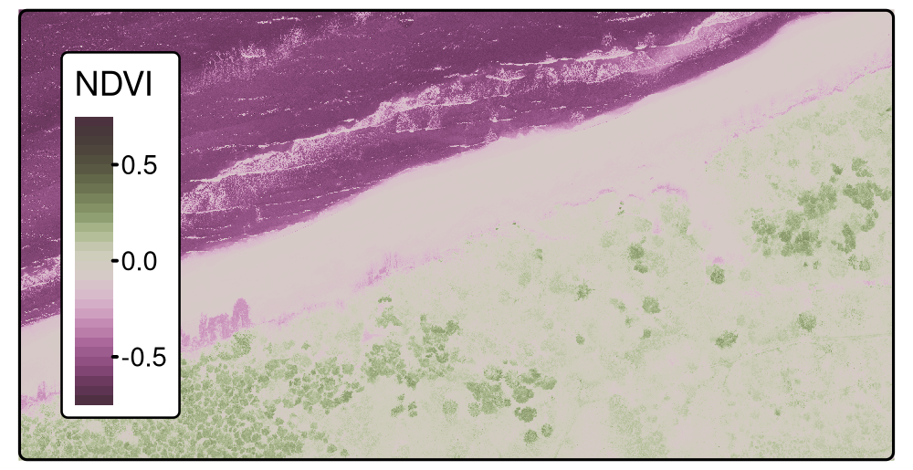{.fragment width="1500"}

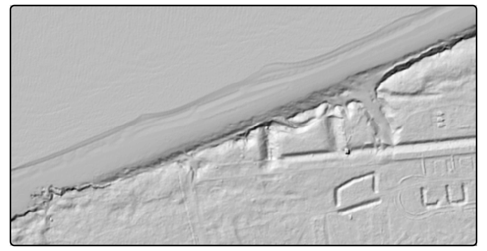{.fragment width="1500"}
:::
Bezpośrednio obserwujemy sygnał (np. odbicie promieniowania), z którego dopiero wnioskujemy o typie pokrycia terenu, kondycji roślinności czy stanie środowiska.

## Pomary terenowe

:::: {.columns}
::: {.column width="32%"}
- Tradycyjne pomiary terenowe (uwzględniające lokalizację): pomiary jakości wody, powietrza, gleby, itd.
- Sieci monitoringowe
- Eksperymenty naukowe

```{r}
#| fig-cap: "CLIMPEAT project (fot. Jan Barabach)"
#| out-width: 88%
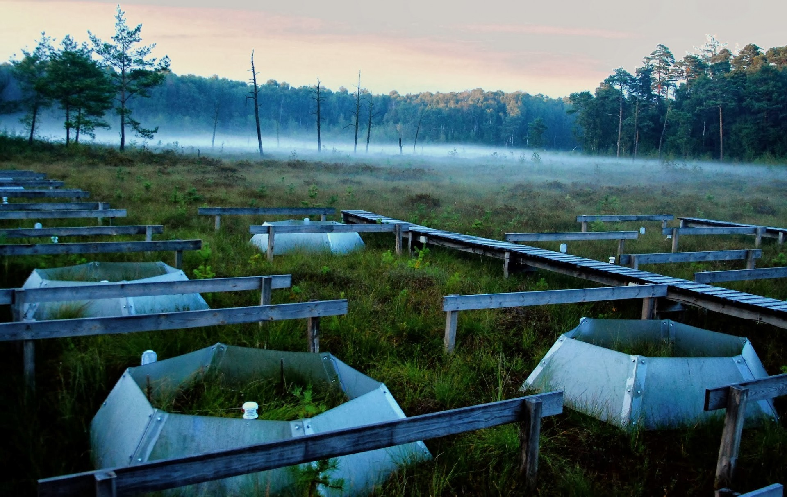
```

:::
::: {.column width="68%"}
*fot. Maurycy Żarczyński*
```{r}
#| fig-align: center
#| out-width: 100%
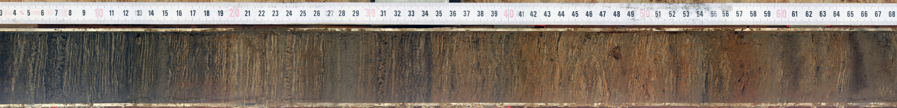
```

```{r}
#| fig-align: center
#| out-width: 100%
#| layout-ncol: 2
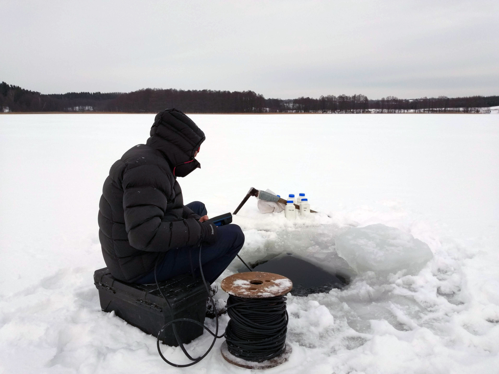
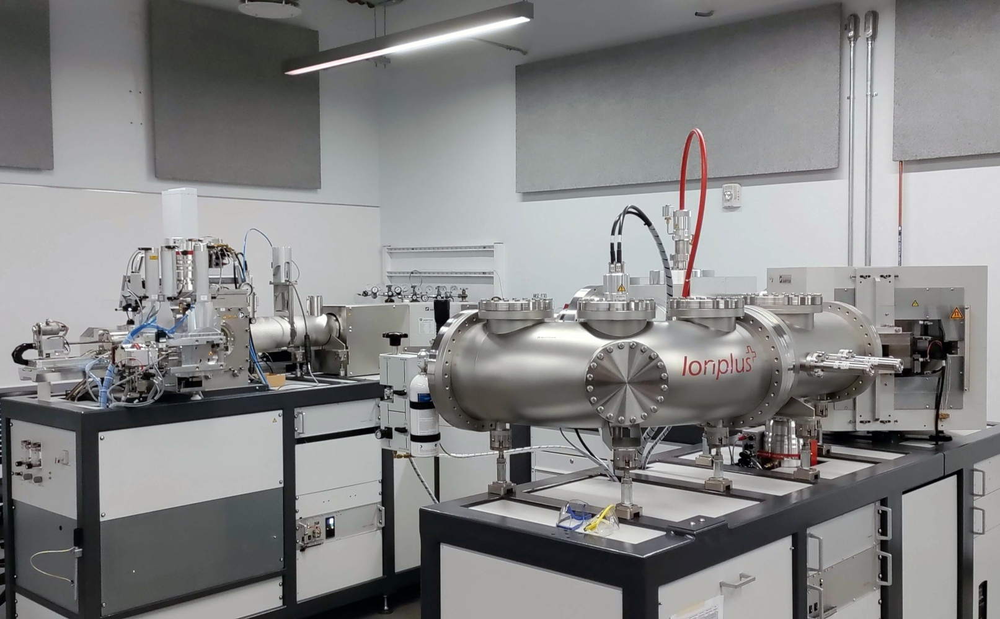
```

:::
::::

*Dane terenowe są droższe i trudniejsze do zebrania, ale często pozostają niezastąpione jako pomiar bezpośredni i punkt odniesienia dla danych zdalnych.*

## Inne źródła danych przestrzennych

:::: {.columns}
::: {.column width="50%"}
- Granice administracyjne
- Dane statystyczne
- Mapy analogowe
- Reanalizy klimatyczne; scenariusze klimatyczne
- Crowdsourcing (np. OpenStreetMap)
- Media społecznościowe (?)
- Dane w czasie rzeczywistym (np. z samochodów autonomicznych)
- ...
:::
::: {.column width="50%"}
```{r}
#| out-width: 60%
#| fig-cap: "<https://luukvdmeer.github.io/sfnetworks>"

```
:::
::::

*W praktyce analizy geograficzne często łączą wiele źródeł danych, bo każde z nich opisuje inny aspekt rzeczywistości i ma inne ograniczenia.*


# Spatial is special (?) {data-background-image="figs/cover.png" data-background-opacity="0.3"}

## Co różni dane przestrzenne od innych?

- **Lokalizacja**: Każdy obiekt powiązany z określoną lokalizacją na powierzchni Ziemi
- **Relacje przestrzenne**: Sąsiedztwo, odległość, topologia
- **Wielowymiarowość**: 2D, 3D, 4D (przestrzeń + czas)

```{r}
#| out-width: 90%
#| fig-align: center
#| fig-cap: "<https://tmap.geocompx.org/>"
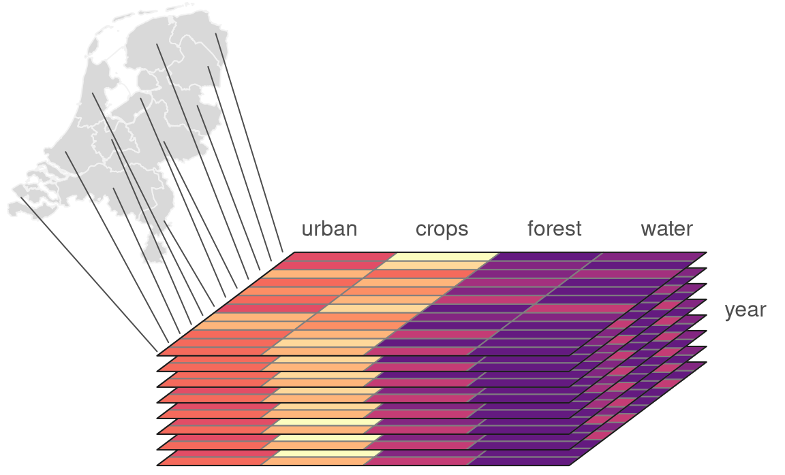
```

:::: {.columns}
::: {.column width="50%"}
W danych tabelarycznych kolejność wierszy zwykle nie ma znaczenia.

W danych przestrzennych położenie i relacje między obiektami są częścią informacji.

:::
::: {.column width="50%"}
**Specyficzne wyzwania:**

- Złamanie założenia niezależności
- MAUP (ang. *Modifiable Areal Unit Problem*)
- Autokorelacja przestrzenna
- Heterogeniczność przestrzenna
:::
::::

## Problem #1: Autokorelacja przestrzenna

*"Wszystko jest związane ze wszystkim innym, ale rzeczy bliskie są bardziej powiązane niż rzeczy oddalone"* (Tobler, 1970)

*"Autocorrelation may be found in the data also due to, for example, omitted variables or inappropriate levels of aggregation"* (Pebesma and Bivand, 2023)

```{r}
#| echo: false
#| fig-align: center
#| fig-height: 4.5
library(tmap)
library(terra)
set.seed(2019-08-20)
r1 = rast(matrix(sample(c(0, 1), size = 36, replace = TRUE), nrow = 6))
r2 = rast(matrix(c(rep(0, 18), rep(1, 18)), nrow = 6))
r3 = rast(matrix(c(rep(0:1, 3), rep(1:0, 3)), nrow = 6, ncol = 6))
r1p = as.polygons(r1, dissolve = FALSE)
tm_r1 = tm_shape(r1) + tm_raster(col.scale = tm_scale_categorical(values = c("#fcdd09", "#b81626")), 
                                 col.legend = tm_legend_hide()) + 
  tm_shape(r1p) + tm_borders() +
  tm_title("Losowość") +
  tm_layout(frame = FALSE)
tm_r2 = tm_shape(r2) + tm_raster(col.scale = tm_scale_categorical(values = c("#fcdd09", "#b81626")), 
                                 col.legend = tm_legend_hide()) + 
  tm_shape(r1p) + tm_borders() +
  tm_title("Dodatnia autokorelacja") +
  tm_layout(frame = FALSE)
tm_r3 = tm_shape(r3) + tm_raster(col.scale = tm_scale_categorical(values = c("#fcdd09", "#b81626")), 
                                 col.legend = tm_legend_hide()) + 
  tm_shape(r1p) + tm_borders() +
  tm_title("Ujemna autokorelacja") +
  tm_layout(frame = FALSE)
tmap_arrange(tm_r2, tm_r1, tm_r3, ncol = 3)
```


<!-- Matematycznie: $P(A|B) \neq P(A)$ dla sąsiednich lokalizacji. -->

Klasyczne metody statystyczne zakładają niezależność obserwacji. **W danych przestrzennych to założenie jest niemal zawsze łamane.**

Bliskość przestrzenna zmienia więc rozkład informacji: obserwacje z sąsiednich lokalizacji są często bardziej podobne niż obserwacje odległe.

## Problem #2: Heterogeniczność przestrzenna

**Heterogeniczność**: Parametry procesów nie są stałe w przestrzeni.

:::: {.columns}
::: {.column width="50%"}
Ta sama zależność między zmiennymi może wyglądać inaczej w różnych miejscach.

**Przykłady:**

- lokalnie różne trendy
- zmienna wariancja błędów
- brak stacjonarności procesu

::: {.fragment}

<br><br><br><br><br>

**Konsekwencje:**

model może dobrze opisywać średni obraz zjawiska, ale źle odwzorowywać lokalne wzorce i zależności

:::

:::
::: {.column width="50%"}
```{r}
#| echo: false
#| fig-align: center
library(ggplot2)
set.seed(2026)
x1 = seq(0, 10, length.out = 30)
y1 = 1 + 0.3 * x1 + rnorm(30, sd = 0.4)
x2 = seq(0, 10, length.out = 30)
y2 = 1 + 1.1 * x2 + rnorm(30, sd = 0.4)

df_het = rbind(
  data.frame(x = x1, y = y1, region = "Region A"),
  data.frame(x = x2, y = y2, region = "Region B")
)

ggplot(df_het, aes(x = x, y = y, color = region)) +
  geom_point(size = 2) +
  geom_smooth(method = "lm", se = FALSE) +
  labs(x = "Predyktor", y = "Odpowiedź", color = "") +
  theme_bw(base_size = 18)
```
:::
::::

## Dlaczego to ma znaczenie?

:::: {.columns}
::: {.column width="60%"}
```{r}
#| echo: false
#| out-width: 90%

```
:::
::: {.column width="40%"}
**Ignorowanie autokorelacji i heterogeniczności prowadzi do:**

- Błędnego oszacowania p-values (często zbyt optymistyczne)
- Niepoprawnych przedziałów ufności
- Fałszywych wniosków o przyczynowości
- Zbyt optymistycznej oceny jakości modeli i ich zdolności do uogólniania

<!-- *Klasyczny t-test na danych przestrzennych może dać p = 0.001... i być kompletnie błędny.* -->
:::
::::

::: aside
*Professor of Statistics (1903), Albert Engström*
:::


# Uczenie maszynowe używając danych przestrzennych {data-background-image="figs/cover.png" data-background-opacity="0.3"}

## Problem: Mapowanie predykcyjne

:::: columns
::: column

Celem jest stworzenie ciągłej mapy na podstawie punktowych obserwacji i predyktorów przestrzennych.

::: aside
Przykład: przewidywanie bogactwa gatunkowego roślin w Ameryce Południowej.
:::

:::
::: column

```{r}
library(sf)
library(terra)
library(CAST)
library(caret)
library(tmap)
tmap_options(scale = 1.5)
data(splotdata, package = "CAST")
south_america = rnaturalearth::ne_countries(continent = "South America", returnclass = "sf")

tm_shape(south_america) +
  tm_borders() +
  tm_shape(splotdata) +
  tm_symbols(fill = "Species_richness", size = 0.5)
```

:::
::::

## Uczenie maszynowe

Metody uczenia maszynowego, takie jak lasy losowe, potrafią wychwycić złożone relacje między predyktorami a zmienną objaśnianą.

```{r}
#| fig-height: 6
# Przygotowanie danych (uproszczone na potrzeby slajdu)
splotdata_df = st_drop_geometry(splotdata)
wc = geodata::worldclim_global(var = "bio", res = 10, path = "data/")
elev = geodata::elevation_global(res = 10, path = "data/")
predictors = crop(c(wc[[c(1, 12, 14)]], elev), st_bbox(splotdata))
names(predictors) = c("bio_1", "bio_12", "bio_14", "elev")

set.seed(10)
model_rf = train(
  splotdata_df[, names(predictors)],
  splotdata_df$Species_richness,
  method = "rf",
  tuneGrid = data.frame("mtry" = 2),
  importance = TRUE,
  ntree = 50,
  trControl = trainControl(method = "cv", number = 3, savePredictions = "final")
)
pred_rf = terra::predict(predictors, model_rf, na.rm = TRUE)
tm_shape(predictors) +
  tm_raster(col.scale = tm_scale_continuous(values = "spectral", midpoint = 0),
            col.legend = tm_legend(title = "",
                                   orientation = "landscape",
                                   position = c("left", "bottom"))) +
  tm_shape(splotdata) +
  tm_dots(shape = 2, col = "black", size = 0.2)
```

**Problem**: Te metody zakładają niezależność obserwacji -- każdy punkt jest traktowany jako niezależny.

*W praktyce ignorowanie autokorelacji przestrzennej i niereprezentatywności próby prowadzi do nadmiernego dopasowania modelu i błędnych generalizacji.*

## Rozkład przestrzenny danych

Dane treningowe w badaniach przyrodniczych są często zaagregowane przestrzennie.

- Niektóre obszary są daleko od punktów treningowych
- Wartości predyktorów dla opróbowanych lokalizacji mogą drastycznie różnić się od tych dla obszarów, które chcemy prognozować

Dane testowe również skupione przestrzennie –- nie reprezentują całego obszaru, który chcemy prognozować.

:::: columns
::: {.column width="30%"}
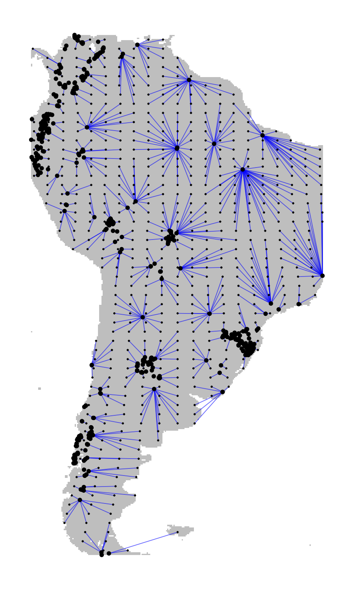{height="600px"}
:::
::: {.column width="70%"}
```{r}
#| fig-height: 4
plot(geodist(splotdata, predictors)) +
  scale_x_sqrt(labels = scales::label_number()) + 
  scale_fill_manual(values = c("steelblue", "tomato"), 
                    name = "distance function") +
  theme_bw(base_size = 16)
```
<!-- To prowadzi do dwóch różnych pytań: -->

1. **Jak wiarygodnie ocenić model?**
2. **Gdzie predykcje modelu są wiarygodne?**
:::
::::

## Rozwiązanie 1: Walidacja dostosowana do domeny predykcyjnej

Standardowa walidacja krzyżowa (*random CV*) daje zbyt optymistyczne wyniki w takich sytuacjach.

> Alternatywa: **walidacja kNNDM** (*k-fold Nearest Neighbour Distance Matching*):
> 
> - Dopasowuje podzbiory walidacyjne, aby odległości treningowo-testowe odpowiadały odległościom predykcyjnym.

::: {.columns}
::: {.column width="60%"}
```{r}
#| fig-height: 5.5
#| fig-width: 10
set.seed(11)
indices_knndm = knndm(splotdata, predictors, k = 5)
plot(geodist(splotdata, predictors, cvfolds = indices_knndm$indx_test)) +
  scale_x_sqrt(labels = scales::label_number()) +
  ggtitle("kNNDM CV") +
  theme_bw(base_size = 16)
```
:::
::: {.column width="40%"}
```{r}
splotdatak = splotdata
splotdatak$knndm = factor(indices_knndm$clusters)
tm_shape(south_america) +
  tm_borders() +
  tm_shape(splotdatak) +
  tm_symbols(fill = "knndm", size = 0.5)
```
:::
::::

::: aside
Jej celem nie jest poprawa samego modelu, ale **bardziej wiarygodna ocena jego jakości** w warunkach zbliżonych do rzeczywistej predykcji.
:::

## Rozwiązanie 2: Obszar stosowalności 

:::: columns
::: column
**Metoda AoA** (*Area of Applicability*) pozwala zidentyfikować obszary, dla których model nie posiada odpowiednich danych treningowych, co czyni predykcje mało wiarygodnymi.

:::
::: column
```{r}
AOA = aoa(predictors,
          train = splotdata_df[c("bio_1", "bio_12", "bio_14", "elev")], 
          verbose = FALSE)
tm_shape(AOA$AOA) +
  tm_raster(col.scale = tm_scale_categorical(),
            col.legend = tm_legend(title = "Wewnątrz AoA")) +
  tm_shape(splotdata) +
  tm_dots(shape = 2, col = "black", size = 0.2) +
  tm_title("Obszar stosowalności (AoA)")
```
:::
::::

::: aside
AoA nie odpowiada więc na pytanie, **jak dobry jest model**, lecz na pytanie, **gdzie można sensownie ufać jego predykcjom**.
:::

## Porównanie: walidacja błędna vs poprawna

:::: {.columns}
::: {.column width="50%"}
**Zbyt optymistyczna ocena modelu:**

```{r}
#| fig-height: 6
tm_shape(pred_rf) +
  tm_raster(col.scale = tm_scale_continuous(values = "spectral", midpoint = 0),
            col.legend = tm_legend(title = "Species richness")) +
  tm_title("Random Forest (bez AoA)")
```

[`r round(global_validation(model_rf)["RMSE"], 2)`]{style="font-size: 160%;"}

*RMSE z walidacji losowej / skupionych danych testowych*
:::
::: {.column width="50%" .fragment}
**Bardziej wiarygodna ocena modelu:**

```{r}
#| fig-height: 6
model_rf_knndm = train(
  splotdata_df[, names(predictors)],
  splotdata_df$Species_richness,
  method = "rf",
  tuneGrid = data.frame("mtry" = 2),
  importance = TRUE,
  trControl = trainControl(
    method = "cv",
    index = indices_knndm$indx_train,
    savePredictions = "final"
  )
)
pred_rf_knndm = terra::predict(predictors, model_rf_knndm, na.rm = TRUE)
pred_rf_knndm_aoa = mask(pred_rf_knndm, AOA[[3]], maskvalues = 0)
tm_shape(pred_rf_knndm_aoa) +
  tm_raster(col.scale = tm_scale_continuous(values = "spectral", midpoint = 0),
            col.legend = tm_legend(title = "Species richness")) +
  tm_title("Random Forest (z AoA)")
```

[`r round(global_validation(model_rf_knndm)[[1]], 2)`]{style="font-size: 160%;"}

*RMSE z walidacji kNNDM; AoA dodatkowo ogranicza interpretację mapy do obszarów wspartych danymi treningowymi*
:::
::::

::: {.fragment}
Do tej pory mówiliśmy głównie o tym, jak modelować **wartości** w przestrzeni.
Teraz przechodzimy do kwestii, jak opisywać i porównywać same **wzorce przestrzenne**.
:::


# Teoria informacji a geografia {data-background-image="figs/cover.png" data-background-opacity="0.3"}

## Dlaczego wzorce są ważne?

Odkrywanie i opisywanie wzorców (ang. *patterns*) to kluczowy element analizy przestrzennej.
Wzorce są powiązane z procesami naturalnymi i społecznymi.

:::: {.columns}
::: {.column width="33%"}
[Podatność krajobrazów leśnych na ekspansję rolnictwa]{style="font-size: 0.8em"}
```{r}
#| out-width: 68%
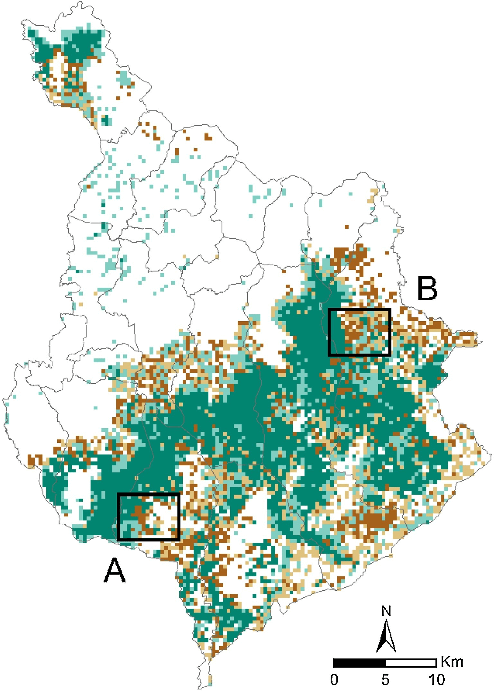
```
[*Bourgoin i in., 2020, [10.1016/j.jag.2019.101958](https://doi.org/10.1016/j.jag.2019.101958)*]{style="font-size: 0.6em"}
:::
::: {.column width="33%"}
[Kwantyfikacja różnorodności i segregacji rasowej]{style="font-size: 0.8em"}
```{r}
#| out-width: 85%
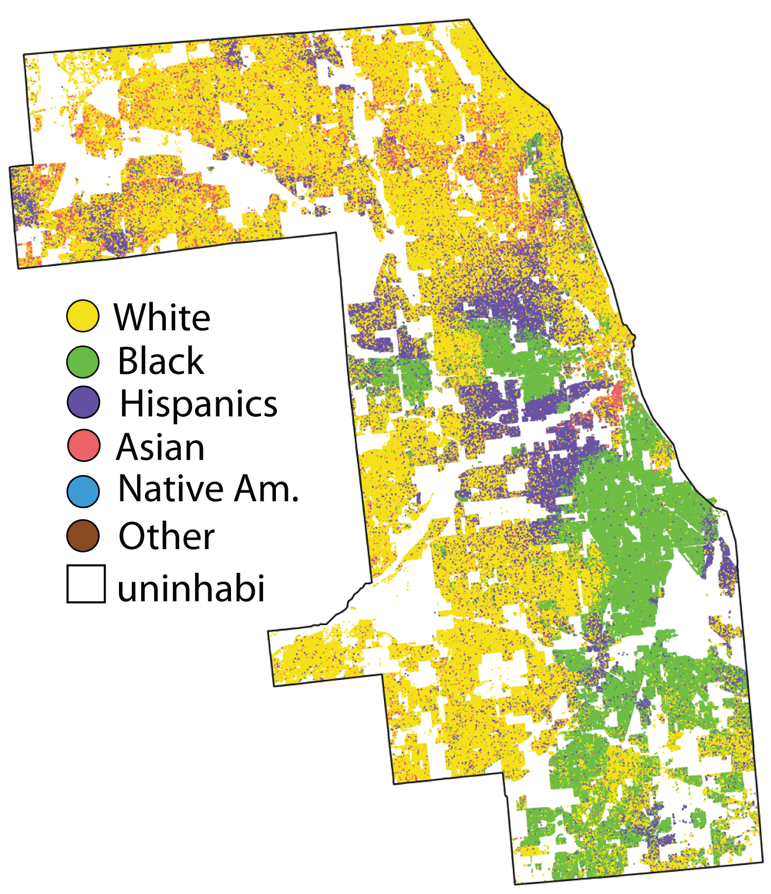
```
[*Dmowska i in., 2020, [10.1016/j.apgeog.2020.102239](https://doi.org/10.1016/j.apgeog.2020.102239)*]{style="font-size: 0.6em"}
:::
::: {.column width="33%"}
[Analiza obrazów histologicznych (np. rak wątroby)]{style="font-size: 0.8em"}
```{r, out.width="100%"}
#| out-width: 100%
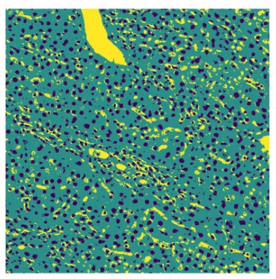
```
[*Kendall i in., 2020, [10.1038/s41598-020-74691-9](https://doi.org/10.1038/s41598-020-74691-9)*]{style="font-size: 0.6em"}
:::
::::

**Problem: Jak opisać i porównać te wzorce ilościowo?**
<!-- W moich badaniach interesuje mnie to, jak takie wzorce opisywać ilościowo — najpierw pojedynczymi miarami, a potem pełniejszymi reprezentacjami umożliwiającymi ich porównywanie. -->

## Sygnatury przestrzenne

<!-- Większość metryk krajobrazowych to pojedyncze liczby przedstawiające specyficzne cechy lokalnego krajobrazu. -->

**Sygnatury przestrzenne** (ang. *spatial signatures*) są wieloelementowymi reprezentacjami kompozycji i konfiguracji krajobrazu.

Punktem wyjścia jest **macierz współwystępowania** (ang. *co-occurrence matrix* (*coma*)), która opisuje lokalną strukturę sąsiedztwa kategorii.

:::: {.columns}
::: {.column width='35%'}
```{r}
#| fig-width: 6
#| fig-height: 6
library(tmap)
lc_palette = c("#FFFF64", "#006400", "#966400", "#BE9600")
landscapes = terra::rast("data/landscapes.grd")
tmc = tm_shape(landscapes[[1]]) +
  tm_raster(col.scale = tm_scale_categorical(values = lc_palette, labels = c("rolnictwo", "las")), 
            col.legend = tm_legend(title = "")) +
  tm_layout(frame = FALSE)
tmc
```
:::
::: {.column width='65%'}

*macierz współwystępowania**:
```{r}
coma1 = comat::get_coma(as.matrix(landscapes[[1]], wide = TRUE))
colnames(coma1) = c("rolnictwo", "las")
rownames(coma1) = colnames(coma1)
knitr::kable(coma1) |>
  kableExtra::column_spec(1, bold = TRUE)
```
:::
::::

## Sygnatury przestrzenne: od macierzy do wektora

Sygnatura przestrzenna powinna dać się zapisać w formie znormalizowanego wektora.

To przejście jest kluczowe: od obiektu przestrzennego przechodzimy do reprezentacji, którą można porównywać matematycznie między obszarami.

:::: {.columns}
::: {.column width='35%'}
```{r}
#| fig-width: 6
#| fig-height: 6
tmc
```
:::
::: {.column width='65%' .incremental}
- **Wektor współwystępowania** (ang. *co-occurrence vector (cove)*):
```{r}
knitr::kable(comat::get_cove(coma1, ordered = TRUE))
```
- **Znormalizowany wektor współwystępowania** (ang. *normalized co-occurrence vector*):
```{r}
knitr::kable(comat::get_cove(coma1, ordered = FALSE, normalization = "pdf"), digits = 4)
```
:::
::::

## Miary z macierzy współwystępowania: entropia

**Entropia brzegowa [H(X)]** – różnorodność tematyczna (kompozycja kategorii):

$$H(X) = -\sum_{i=1}^{n} p_i \log_2 p_i$$

gdzie $p_i$ to proporcja kategorii $i$ w krajobrazie.

:::: {.columns .fragment}
::: {.column width="60%"}
```{r}
#| fig-height: 6
library(tmap)
library(landscapemetrics)
lc_palette = c("#FFFF64", "#006400", "#966400", "#BE9600")
landscapes = terra::rast("data/landscapes.grd")
tmc2 = tm_shape(landscapes) +
  tm_raster(col.scale = tm_scale_categorical(values = lc_palette, labels = c("rolnictwo", "las", "tereny zakrzewione", "nieużytki")), 
            col.legend = tm_legend(title = "")) +
  tm_facets(free.scales = FALSE, ncol = 3)
tmc2 +
  tm_layout(panel.labels = round(lsm_l_ent(landscapes)$value, 2), 
            panel.label.size = 2,
            main.title = "Entropia brzegowa [H(x)]")
```
:::
::: {.column width="40%"}
<br><br><br><br><br><br><br>
Wyższa wartość = większa różnorodność kategorii

W teorii informacji: miara niepewności.

W geografii: miara kompozycji wzorca.
:::
::::

## Miary z macierzy współwystępowania: konfiguracja

**Informacja wzajemna** –- ile informacji niesie sąsiedztwo:

$$I(X;Y) = H(X) - H(X|Y) = \sum_{i,j} p_{ij} \log_2 \frac{p_{ij}}{p_i p_j}$$

**Względna informacja wzajemna** (znormalizowana): $U = \frac{I(Y,X)}{H(X)} \in [0,1]$

:::: {.columns .fragment}
::: {.column width="60%"}
```{r}
#| fig-height: 6
rel_mut_inf = lsm_l_mutinf(landscapes)$value / lsm_l_ent(landscapes)$value
tmc2 +
  tm_layout(panel.labels = round(rel_mut_inf, 2), 
            panel.label.size = 2,
            main.title = "Względna informacja wzajemna [U]")
```
:::
::: {.column width="40%"}
<br><br><br><br><br><br><br>
$U \approx 0$: losowe rozmieszczenie

$U \approx 1$: silna autokorelacja przestrzenna

Opisuje konfigurację wzorca, ale nadal sprowadza ją do jednej liczby.
:::
::::

## Idea PBSA: Podziel i opisz

Podejście PBSA (ang. *pattern-based spatial analysis*) polega na:

1. Podziale danych na dużą liczbę mniejszych obszarów (lokalnych krajobrazów).
2. Reprezentacji każdego obszaru za pomocą **sygnatury przestrzennej** (np. wektora współwystępowania).
3. Porównywaniu sygnatur przy użyciu miar odległości (np. Jensen-Shannon, Canberra).

W ten sposób przechodzimy od opisu pojedynczego wzorca do analizy całych zbiorów wzorców.

```{r}
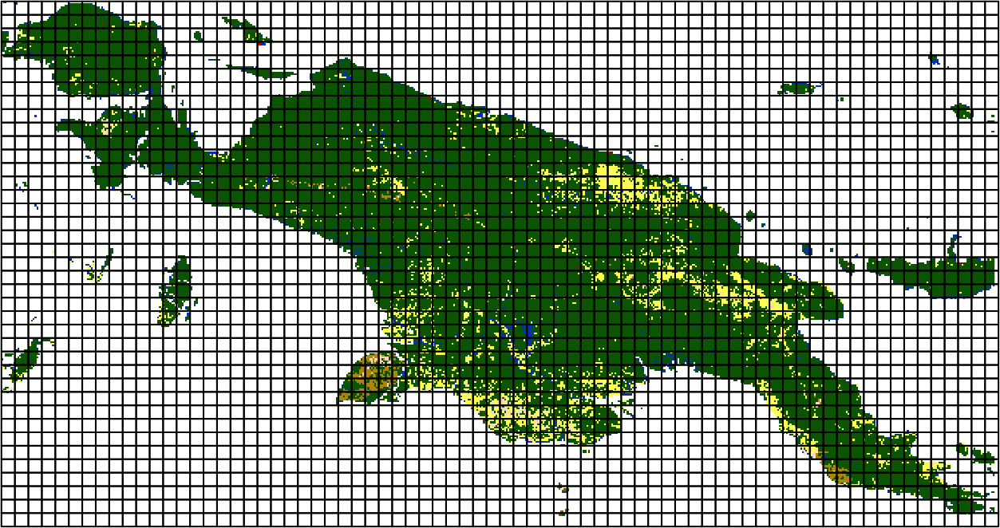
```

::: {.fragment}
Pozwala to na: **wyszukiwanie podobieństw**, **wykrywanie zmian**, **grupowanie (clustering)** i **segmentację**.
:::

## PBSA w praktyce

:::: {.columns}
::: {.column width="33%"}
**Wyszukiwanie** (1-do-wielu)
Znajdź obszary o rzeźbie terenu podobnej do Suwalszczyzny.
```{r, out.width="100%"}
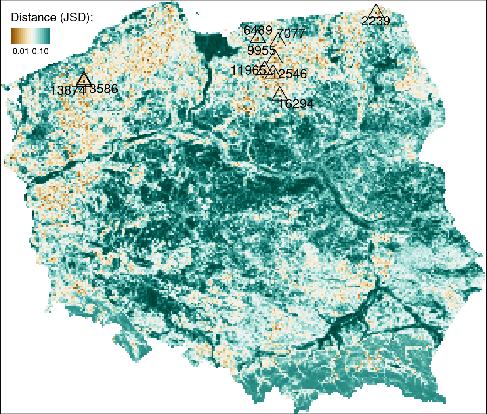
```
:::
::: {.column width="33%"}
**Porównywanie** (1-do-1)
Ilościowa ocena zmian struktury (np. wylesianie Amazonii).
```{r, out.width="100%"}
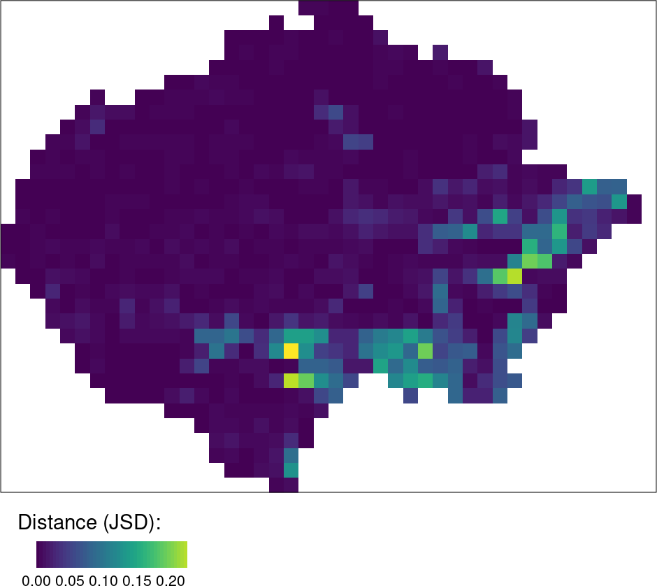
```
:::
::: {.column width="33%"}
**Grupowanie** (wiele-do-wielu)
Regionalizacja na podstawie wzorców pokrycia terenu.
```{r, out.width="100%"}
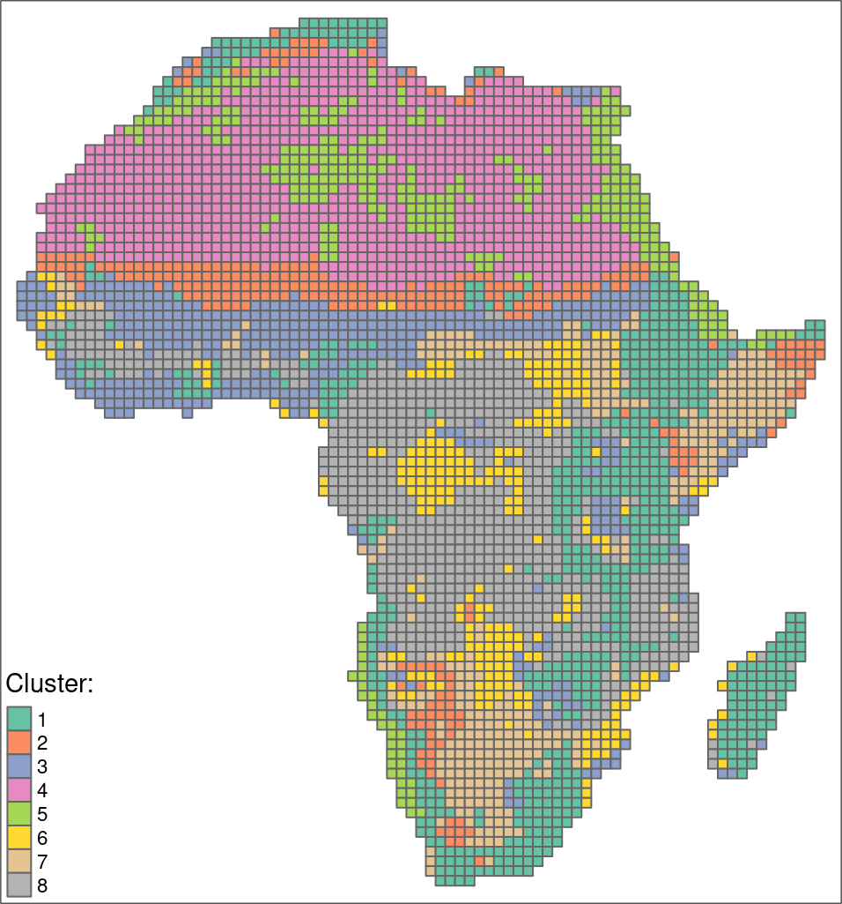
```
:::
::::


# Co dalej? Nowe horyzonty

## Co dalej? Nowe horyzonty

:::: {.columns}
::: {.column width="58%"}
Coraz częściej celem nie jest już tylko analiza pojedynczych zmiennych, lecz tworzenie **solidnych i użytecznych reprezentacji przestrzeni**.

::: {.incremental}
- **Embeddingi i modele fundamentalne (foundation models)** próbują tworzyć uniwersalne reprezentacje obrazów satelitarnych oraz danych wieloźródłowych
- **Grafowe sieci neuronowe** pozwalają modelować obiekty przestrzenne wraz z relacjami sąsiedztwa
- **Globalne siatki dyskretne** oferują nowe podejście do reprezentacji danych przestrzennych
- **Wspólny mianownik**: przejście od pojedynczych wartości do struktur i relacji
:::
:::
::: {.column width="42%"}
Z matematycznego punktu widzenia szczególnego znaczenia nabierają:

- geometria i topologia danych  
- uczenie reprezentacji  
- analiza grafów  
- miary podobieństwa i odległości  

To właśnie na tym styku geografia i matematyka spotykają się dziś szczególnie intensywnie.
:::
::::

# Podsumowanie

## Podsumowanie

:::: {.columns}
::: {.column width="52%" .incremental}

- **Matematyka daje geografii** formalizację i precyzję
- **Geografia daje matematyce** złożoność rzeczywistego świata i realne problemy do rozwiązania
- **Przestrzeń** zmienia sposób, w jaki zbieramy dane, budujemy modele i interpretujemy wyniki
- **Wzorce przestrzenne** są wspólnym językiem dla geografii, statystyki i uczenia maszynowego
- **Wyzwanie**: zrozumieć przestrzeń jako układ relacji, a nie tylko zbiór punktów i wartości

:::
::: {.column width="43%" .faded-right}
<div style="text-align: right">
### Kontakt

Strona: <https://jakubnowosad.com>

### Materiały

Slajdy: <https://jakubnowosad.com/horyzontymatematyki2026>

</div>

```{r}
#| echo: false
#| out-width: 75%
#| fig-align: right

```
:::
::::

```{r}

```