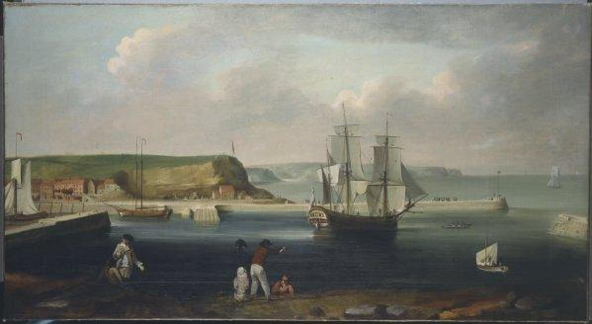

## Geografia

::: {style="font-size: 164%;line-height: 164%;"}
1. «nauka badająca powłokę Ziemi, jej przestrzenne zróżnicowanie pod względem przyrodniczym i społeczno-gospodarczym»
2. «wydział lub kierunek na wyższej uczelni zajmujący się tą nauką»
3. «nauka geografii jako przedmiot w szkole; też: lekcja tego przedmiotu»
4. «rozkład, rozmieszczenie elementów w obrębie jakiegoś zjawiska»
:::

::: aside
<https://sjp.pwn.pl/slowniki/geografia.html>
:::

## Geografia w starożytności

:::: {.columns}
::: {.column width="40%"}
Babilonia: Babilońska mapa świata (*Imago Mundi*, ~VIII wiek p.n.e.)
```{r}
#| fig-cap: "<https://en.wikipedia.org/wiki/Babylonian_Map_of_the_World>"
knitr::include_graphics("figs/history-babylonian.jpg")
```
:::
::: {.column width="60%"}
Starożytna Grecja: 
*Rekonstrukcja świata z opisów Herodota (V wiek p.n.e.)*
```{r}
#| fig-cap: "<https://pl.wikipedia.org/wiki/Herodot>"
knitr::include_graphics("figs/historia-herodot.png")
```
:::
::::

## Era wielkich odkryć geograficznych

```{r}
#| fig-cap: "<https://en.wikipedia.org/wiki/Age_of_Discovery>"
knitr::include_graphics("figs/historia-Age_of_Discovery_explorations_in_English.png")
```

## Geografia w XVIII i XIX wieku

:::: {.columns}
::: {.column width="50%"}
```{r}
#| out-width: 40%
#| fig-cap: "Chronometr H4, © National Maritime Museum, Greenwich, London"

```
```{r}
#| fig-cap: "Thomas Luny, HMB Endeavour (statek Jamesa Cooka)"

```
:::
::: {.column width="50%"}
Zapotrzebowanie na wiedzę geograficzną wzrastało: co wymagało to przygotowania nauczycieli i instytucji
```{r}
#| fig-cap: "Lekcja geografii (koniec XIX wieku, Kijów), <https://www.encyclopediaofukraine.com>"
knitr::include_graphics("figs/history-lesson.jpg")
```
:::
::::

## Złoty wiek geografii

::::{.columns}
::: {.column width="35%"}
```{r}
#| out-width: 40%
#| fig-cap: "Royal Geographical Society (1830)"
knitr::include_graphics("figs/history-rgs.png")
```
```{r}
#| out-width: 60%
#| fig-cap: "International Geographical Union (1871/1922)"

```
:::
::: {.column width="65%"}
```{r}
#| fig-cap: "Wyprawa Amundsena na biegun południowy (1911)"
knitr::include_graphics("figs/history-pole.jpg")
```
:::
::::

## Kryzys tożsamości geografii

- Utrata dotychczasowej podstawowej funkcji poznawczej, polegającej na rozszerzaniu tzw. horyzontu geograficznego
- Wyzwania w zdefiniowaniu celu i zakresu geografii
- Rozdział między geografami fizycznymi (naukowcy zajmujący się środowiskiem), a geografami człowieka/społeczno-ekonomicznymi (nauki społeczne)

:::: {.columns}
::: {.column width="50%"}
Inne:

- Zróżnicowanie geograficzne geografii
- Rozdrobienie/specjalizacja (geomorfologia, biogeografia, klimatologia, itd.)
- Coraz większa rozbieżność pomiędzy geografią szkolną a akademicką

:::
::: {.column width="50%"}
```{r}
knitr::include_graphics("figs/egg2.gif")
```
:::
::::

## Współczesne pomysły na geografię: źródła pytań

::: {.incremental}
- Podstawowe koncepcje pozostają niezmienne: rozwiązywanie kwestii tego, co znajduje się gdzie i dlaczego (*interakcje ludzi z ich naturalnym i społecznym otoczeniem*)
- Geografia zawsze była nauką stosowaną; znaczna część wiedzy geograficznej została stworzona dla konkretnych celów
- Stosowanie większego nacisku na naukowy rygor (wnioskowanie dedukcyjne, testowanie hipotez i tworzenie wyjaśniających praw)
:::

## Współczesne pomysły na geografię: narzędzia

::: {.incremental}
- W geografii coraz ważniejsze stało się używanie metod ilościowych, aby dostarczyć precyzyjne opisy i dokładne, odtwarzalne wyniki badań
- W geografii fizycznej stosowane metody są zbliżone do nauk środowiskowych; wymagana jest wiedza z fizyki, chemii, biologii i **matematyki**
- Analiza danych przestrzennych została ułatwiona dzięki rozwojowi mocy obliczeniowej, algorytmów i dostępności danych
:::


# Dane przestrzenne {data-background-image="figs/cover.png" data-background-opacity="0.3"}

## Skąd się biorą dane przestrzenne?

:::: {.columns}
::: {.column width="30%"}
```{r}
#| fig-align: center
#| out-width: 90%
knitr::include_graphics("figs/history-first.jpg")
```
::: aside
[https://www.esa.int](https://www.esa.int/Applications/Observing_the_Earth/Meteorological_missions/meteosat_third_generation/New_weather_satellite_reveals_spectacular_images_of_Earth)

<http://zbip-lwem.home.amu.edu.pl/>
:::
:::
::: {.column width="70%"}
```{r}
#| fig-align: center
#| out-width: 60%
knitr::include_graphics("figs/data-earth.gif")
```

```{r}
#| fig-align: center
#| out-width: 60%
knitr::include_graphics("figs/data-micro.jpg")
```
:::
::::

## Teledetekcja

:::: {.columns}
::: {.column width="50%"}
```{r}
#| fig-align: center
#| out-width: 70%
knitr::include_graphics("figs/data-sen1.jpg")
```
Misje satelitarne: Landsat, MODIS, Sentinel, itd.

Typ misji: publiczna/komercyjna

Typ sensora: pasywny/aktywny

Typ danych: optyczne/radarowe, itd.

Rozdzielczość: przestrzenna/czasowa/spektralna
:::
::: {.column width="50%"}
```{r}
#| fig-align: center
#| out-width: 60%
knitr::include_graphics("figs/data-sen2.jpg")
```
```{r}
#| fig-cap: "<https://en.wikipedia.org/wiki/Sentinel-1>, <https://en.wikipedia.org/wiki/Sentinel-2>"
#| fig-align: center
#| out-width: 60%
knitr::include_graphics("figs/data-sen3.jpg")
```
:::
::::


## Teledetekcja

::: {.r-stack}
{width="1500"}

{.fragment width="1500"}

{.fragment width="1500"}
:::

## Pomary terenowe

:::: {.columns}
::: {.column width="30%"}
- Tradycyjne pomiary terenowe (uwzględniające lokalizację): pomiary jakości wody, powietrza, gleby, itd.
- Sieci monitoringowe
- Eksperymenty naukowe
:::
::: {.column width="70%"}
```{r}
#| fig-cap: "CLIMPEAT project (fot. Jan Barabach)"
knitr::include_graphics("figs/data-climpeat.jpg")
```
:::
::::

## Pomary terenowe

```{r}
#| fig-align: center
knitr::include_graphics("figs/rdzen LAZ10-09 - osady warwowe - jezioro Łazduny - poj. mazurskie - okolice Orzysza.JPG")
```

:::: {.columns}
::: {.column width="50%"}
```{r}
#| fig-align: center
#| out-width: 90%
knitr::include_graphics("figs/limnologia zimą - Jezioro Żabińskie - mazury - okolice giżycka.jpg")
```
:::
::: {.column width="50%"}
```{r}
#| fig-cap: "fot. Maurycy Żarczyński"
#| fig-align: center
knitr::include_graphics("figs/akceleratorowa spektrometria masowa (AMS) - datowanie 14c - NAU - Flagstaff - podobny w Gliwicach, starszy w Poznaniu.jpg")
```
:::
::::

## Inne źródła danych przestrzennych

:::: {.columns}
::: {.column width="50%"}
- Granice administracyjne
- Dane statystyczne
- Mapy analogowe
- Reanalizy klimatyczne; scenariusze klimatyczne
- Crowdsourcing (np. OpenStreetMap)
- Media społecznościowe (?)
- Dane w czasie rzeczywistym (np. z samochodów autonomicznych)
- ...
:::
::: {.column width="50%"}
```{r}
#| out-width: 90%
#| fig-cap: "<https://luukvdmeer.github.io/sfnetworks>"
knitr::include_graphics("figs/sfnetwork.png")
```
:::
::::

# Spatial is special (?) {data-background-image="figs/cover.png" data-background-opacity="0.3"}

## Co różni dane przestrzenne od innych?

- **Lokalizacja**: Każdy obiekt powiązany z określoną lokalizacją na powierzchni Ziemi
- **Relacje przestrzenne**: Sąsiedztwo, odległość, topologia
- **Wielowymiarowość**: 2D, 3D, 4D (przestrzeń + czas)

:::: {.columns}
::: {.column width="50%"}

:::
::: {.column width="50%"}
**Specyficzne wyzwania:**

- Złamanie założenia niezależności
- MAUP (Modifiable Areal Unit Problem)
- Heterogeniczność przestrzenna
- Autokorelacja przestrzenna
:::
::::

## Problem #1: Autokorelacja przestrzenna

*"Wszystko jest związane ze wszystkim innym, ale rzeczy bliskie są bardziej powiązane niż rzeczy oddalone"* (Tobler, 1970)

*"Autocorrelation may be found in the data also due to, for example, omitted variables or inappropriate levels of aggregation"* (Pebesma and Bivand, 2023)


:::: {.columns}
::: {.column width="50%"}
<!-- Matematycznie: $P(A|B) \neq P(A)$ dla sąsiednich lokalizacji. -->

Klasyczne metody statystyczne zakładają niezależność obserwacji. **W danych przestrzennych to założenie jest niemal zawsze łamane.**

:::
::: {.column width="50%"}
```{r}
#| echo: false
#| fig-align: center
library(tmap)
library(terra)
set.seed(2019-08-20)
r1 = rast(matrix(sample(c(0, 1), size = 36, replace = TRUE), nrow = 6))
r2 = rast(matrix(c(rep(0, 18), rep(1, 18)), nrow = 6))
r3 = rast(matrix(c(rep(0:1, 3), rep(1:0, 3)), nrow = 6, ncol = 6))
r1p = as.polygons(r1, dissolve = FALSE)
tm_r1 = tm_shape(r1) + tm_raster(col.scale = tm_scale_categorical(values = c("#fcdd09", "#b81626")), 
                                 col.legend = tm_legend_hide()) + 
  tm_shape(r1p) + tm_borders() +
  tm_title("Losowość") +
  tm_layout(frame = FALSE)
tm_r2 = tm_shape(r2) + tm_raster(col.scale = tm_scale_categorical(values = c("#fcdd09", "#b81626")), 
                                 col.legend = tm_legend_hide()) + 
  tm_shape(r1p) + tm_borders() +
  tm_title("Dodatnia autokorelacja") +
  tm_layout(frame = FALSE)
tm_r3 = tm_shape(r3) + tm_raster(col.scale = tm_scale_categorical(values = c("#fcdd09", "#b81626")), 
                                 col.legend = tm_legend_hide()) + 
  tm_shape(r1p) + tm_borders() +
  tm_title("Ujemna autokorelacja") +
  tm_layout(frame = FALSE)
tmap_arrange(tm_r2, tm_r1, tm_r3, ncol = 3)
```
:::
::::

## Problem #2: Niejednorodność przestrzenna

**Heterogeniczność**: Parametry procesów nie są stałe w przestrzeni.

:::: {.columns}
::: {.column width="60%"}
<!-- **Przykłady:**

- Lokalne różnice w trendach
- Zmienne wariancje
- Brak stacjonarności

**Podejścia:**

- Geographically Weighted Regression (GWR)
- Lokalne modele
- Stratyfikacja przestrzenna -->
:::
::: {.column width="40%"}
```{r}
#| fig-cap: "[PLACEHOLDER] Przykład heterogeniczności"
# Można dodać mapę pokazującą zmienne parametry w przestrzeni
# knitr::include_graphics("figs/heterogeneity_example.png")
```
:::
::::

## Dlaczego to ma znaczenie?

:::: {.columns}
::: {.column width="60%"}
```{r}
#| echo: false
#| out-width: 90%
knitr::include_graphics("figs/prof.jpg")
```
:::
::: {.column width="40%"}
Ignorowanie autokorelacji i heterogeniczności prowadzi do:

- Błędnego oszacowania p-values (często zbyt optymistyczne)
- Niepoprawnych przedziałów ufności
- Fałszywych wniosków o przyczynowości

<!-- *Klasyczny t-test na danych przestrzennych może dać p = 0.001... i być kompletnie błędny.* -->
:::
::::

::: aside
*Professor of Statistics (1903), Albert Engström*
:::

# Uczenie maszynowe w geografii {data-background-image="figs/cover.png" data-background-opacity="0.3"}

## Problem: Mapowanie predykcyjne

:::: columns
::: column

Celem jest stworzenie ciągłej mapy na podstawie punktowych obserwacji i predyktorów przestrzennych.

Przykład: przewidywanie bogactwa gatunkowego roślin w Ameryce Południowej.

:::
::: column

```{r}
library(sf)
library(terra)
library(CAST)
library(caret)
library(tmap)
tmap_options(scale = 1.5)
data(splotdata, package = "CAST")
south_america = rnaturalearth::ne_countries(continent = "South America", returnclass = "sf")

tm_shape(south_america) +
  tm_borders() +
  tm_shape(splotdata) +
  tm_symbols(fill = "Species_richness", size = 0.5)
```

:::
::::

## Uczenie maszynowe

Metody uczenia maszynowego, takie jak lasy losowe, potrafią wychwycić złożone relacje między predyktorami a zmienną objaśnianą.

```{r}
#| fig-height: 6
# Przygotowanie danych (uproszczone na potrzeby slajdu)
splotdata_df = st_drop_geometry(splotdata)
wc = geodata::worldclim_global(var = "bio", res = 10, path = "data/")
elev = geodata::elevation_global(res = 10, path = "data/")
predictors = crop(c(wc[[c(1, 12, 14)]], elev), st_bbox(splotdata))
names(predictors) = c("bio_1", "bio_12", "bio_14", "elev")

set.seed(10)
model_rf = train(
  splotdata_df[, names(predictors)],
  splotdata_df$Species_richness,
  method = "rf",
  tuneGrid = data.frame("mtry" = 2),
  importance = TRUE,
  ntree = 50,
  trControl = trainControl(method = "cv", number = 3, savePredictions = "final")
)
pred_rf = terra::predict(predictors, model_rf, na.rm = TRUE)
tm_shape(predictors) +
  tm_raster(col.scale = tm_scale_continuous(values = "spectral", midpoint = 0),
            col.legend = tm_legend(title = "",
                                   orientation = "landscape",
                                   position = c("left", "bottom"))) +
  tm_shape(splotdata) +
  tm_dots(shape = 2, col = "black", size = 0.2)
```

**Problem**: Te metody zakładają niezależność obserwacji: każdy punkt jest traktowany jako niezależny.

*W praktyce ignorowanie autokorelacji przestrzennej prowadzi do nadmiernego dopasowania i błędnych generalizacji.*

## Rozkład przestrzenny danych

Dane treningowe w badaniach przyrodniczych są często zaagregowane przestrzennie.

- Niektóre obszary daleko od punktów treningowych
- Wartości predyktorów dla opróbowanych lokalizacji mogą drastycznie różnić się od tych dla obszarów, które chcemy prognozować

:::: columns
::: column
```{r}
#| fig-height: 6
tm_shape(south_america) +
  tm_borders() +
  tm_shape(splotdata) +
  tm_symbols(fill = "Species_richness", size = 0.5)
```
:::
::: column
```{r}
#| fig-height: 6
plot(geodist(splotdata, predictors)) +
  scale_x_sqrt(labels = scales::label_number()) + 
  scale_fill_manual(values = c("steelblue", "tomato"), 
                    name = "distance function") +
  theme_bw(base_size = 24)
```
:::
::::

Dane testowe również skupione przestrzennie –- nie reprezentują całego obszaru, który chcemy prognozować.

## Rozwiązanie 1: Walidacja przestrzenna

Standardowa walidacja krzyżowa (*random CV*) daje zbyt optymistyczne wyniki.

Alternatywa; **walidacja kNNDM** (*k-fold Nearest Neighbour Distance Matching*):

Dopasowuje podzbiory walidacyjne, aby odległości treningowo-testowe odpowiadały odległościom predykcyjnym.

::: {.columns}
::: {.column width="60%"}
```{r}
#| fig-height: 6
#| fig-width: 10
set.seed(11)
indices_knndm = knndm(splotdata, predictors, k = 5)
plot(geodist(splotdata, predictors, cvfolds = indices_knndm$indx_test)) +
  scale_x_sqrt(labels = scales::label_number()) +
  ggtitle("kNNDM CV: k-fold nearest-neighbour distance matching") +
  theme_bw(base_size = 24)
```
:::
::: {.column width="40%"}
{height="600px"}
:::
::::

## Rozwiązanie 2: Obszar stosowalności 

:::: columns
::: column
Metoda AoA (*Area of Applicability*) pozwala zidentyfikować obszary, dla których model nie posiada odpowiednich danych treningowych, co czyni predykcje mało wiarygodnymi.
:::
::: column
```{r}
AOA = aoa(predictors,
          train = splotdata_df[c("bio_1", "bio_12", "bio_14", "elev")], 
          verbose = FALSE)
tm_shape(AOA$AOA) +
  tm_raster(col.scale = tm_scale_categorical(),
            col.legend = tm_legend(title = "Wewnątrz AoA")) +
  tm_shape(splotdata) +
  tm_dots(shape = 2, col = "black", size = 0.2) +
  tm_title("Obszar stosowalności (AoA)")
```
:::
::::

::: aside
Meyer and Pebesma (2021)
:::

## Porównanie: walidacja błędna vs poprawna

:::: {.columns}
::: {.column width="50%"}
**Bez AoA (błędna walidacja):**

```{r}
#| fig-height: 6
tm_shape(pred_rf) +
  tm_raster(col.scale = tm_scale_continuous(values = "spectral", midpoint = 0),
            col.legend = tm_legend(title = "Species richness")) +
  tm_title("Random Forest (bez AoA)")
```

[`r round(global_validation(model_rf)["RMSE"], 2)`]{style="font-size: 160%;"}

*RMSE z walidacji losowej / skupionych danych testowych*
:::
::: {.column width="50%"}
**Z AoA + kNNDM (poprawna walidacja):**

```{r}
#| fig-height: 6
model_rf_knndm = train(
  splotdata_df[, names(predictors)],
  splotdata_df$Species_richness,
  method = "rf",
  tuneGrid = data.frame("mtry" = 2),
  importance = TRUE,
  trControl = trainControl(
    method = "cv",
    index = indices_knndm$indx_train,
    savePredictions = "final"
  )
)
pred_rf_knndm = terra::predict(predictors, model_rf_knndm, na.rm = TRUE)
pred_rf_knndm_aoa = mask(pred_rf_knndm, AOA[[3]], maskvalues = 0)
tm_shape(pred_rf_knndm_aoa) +
  tm_raster(col.scale = tm_scale_continuous(values = "spectral", midpoint = 0),
            col.legend = tm_legend(title = "Species richness")) +
  tm_title("Random Forest (z AoA)")
```

[`r round(global_validation(model_rf_knndm)[[1]], 2)`]{style="font-size: 160%;"}

*RMSE z walidacji adaptacyjnej względem domeny predykcji (kNNDM)*
:::
::::

# Teoria informacji a geografia {data-background-image="figs/cover.png" data-background-opacity="0.3"}

## Dlaczego wzorce są ważne?

Odkrywanie i opisywanie wzorców (*patterns*) to kluczowy element analizy przestrzennej.
Wzorce są powiązane z procesami naturalnymi i społecznymi.

:::: {.columns}
::: {.column width="33%"}
[Podatność krajobrazów leśnych na ekspansję rolnictwa]{style="font-size: 0.8em"}
```{r, out.width="78%"}
knitr::include_graphics("figs/wietnam-paper.png")
```
[*Bourgoin i in., 2020, [10.1016/j.jag.2019.101958](https://doi.org/10.1016/j.jag.2019.101958)*]{style="font-size: 0.6em"}
:::
::: {.column width="33%"}
[Kwantyfikacja segregacji rasowej i różnorodności]{style="font-size: 0.8em"}
```{r, out.width="85%"}
knitr::include_graphics("figs/raceland-fig.png")
```
[*Dmowska i in., 2020, [10.1016/j.apgeog.2020.102239](https://doi.org/10.1016/j.apgeog.2020.102239)*]{style="font-size: 0.6em"}
:::
::: {.column width="33%"}
[Analiza obrazów histologicznych (np. rak wątroby)]{style="font-size: 0.8em"}
```{r, out.width="100%"}
knitr::include_graphics("figs/histo-paper.png")
```
[*Kendall i in., 2020, [10.1038/s41598-020-74691-9](https://doi.org/10.1038/s41598-020-74691-9)*]{style="font-size: 0.6em"}
:::
::::

## Sygnatury przestrzenne

Większość metryk krajobrazowych to pojedyncze liczby przedstawiające specyficzne cechy lokalnego krajobrazu.

**Sygnatury przestrzenne** (ang. *spatial signatures*), z drugiej strony, są wieloelementowymi reprezentacjami kompozycji i konfiguracji krajobrazu.

:::: {.columns}
::: {.column width='35%'}
```{r}
#| fig-width: 6
#| fig-height: 6
library(tmap)
lc_palette = c("#FFFF64", "#006400", "#966400", "#BE9600")
landscapes = terra::rast("data/landscapes.grd")
tm_shape(landscapes[[1]]) +
  tm_raster(palette = lc_palette, style = "cat", legend.show = FALSE) +
  tm_layout(frame = FALSE)
```
:::
::: {.column width='65%'}

Podstawowa sygnatura to **macierz współwystępowania** (ang. *co-occurrence matrix* (*coma*)):
```{r}
coma1 = comat::get_coma(as.matrix(landscapes[[1]], wide = TRUE))
colnames(coma1) = c("rolnictwo", "las")
rownames(coma1) = colnames(coma1)
knitr::kable(coma1) |>
  kableExtra::column_spec(1, bold = TRUE)
```
:::
::::

## Sygnatury przestrzenne: od macierzy do wektora

Sygnatura przestrzenna musi pozwalać na uproszczanie jej do formy znormalizowanego wektora.

:::: {.columns}
::: {.column width='35%'}
```{r}
#| fig-width: 6
#| fig-height: 6
tm_shape(landscapes[[1]]) +
  tm_raster(palette = lc_palette, style = "cat", legend.show = FALSE) +
  tm_layout(frame = FALSE)
```
:::
::: {.column width='65%' .incremental}
- **Wektor współwystępowania** (ang. *co-occurrence vector (cove)*):
```{r}
knitr::kable(comat::get_cove(coma1, ordered = TRUE)) |> 
  kableExtra::kable_styling(font_size = 16)
```
- **Znormalizowany wektor współwystępowania** (ang. *normalized co-occurrence vector*):
```{r}
knitr::kable(comat::get_cove(coma1, ordered = FALSE, normalization = "pdf"), digits = 4) |> 
  kableExtra::kable_styling(font_size = 16)
```
:::
::::

## Entropia: Miara różnorodności

**Marginalna entropia [H(X)]** – różnorodność tematyczna (kompozycja kategorii):

$$H(X) = -\sum_{i=1}^{n} p_i \log_2 p_i$$

gdzie $p_i$ to proporcja kategorii $i$ w krajobrazie.

:::: {.columns}
::: {.column width="50%"}
```{r}
#| fig-cap: "Marginalna entropia [H(x)]"
library(tmap)
library(landscapemetrics)
lc_palette = c("#FFFF64", "#006400", "#966400", "#BE9600")
landscapes = terra::rast("data/landscapes.grd")
tm_shape(landscapes) +
  tm_raster(palette = lc_palette, style = "cat", legend.show = FALSE) +
  tm_facets(free.scales = FALSE, ncol = 3) +
  tm_layout(panel.labels = round(lsm_l_ent(landscapes)$value, 2), 
            panel.label.size = 2,
            main.title = "Marginal entropy [H(x)]")
```
:::
::: {.column width="50%"}
Wyższa wartość = większa różnorodność.

W teorii informacji: miara niepewności.

W geografii: kluczowa w analizach środowiskowych i planowaniu przestrzennym.
:::
::::

## Względna informacja wzajemna: Miara konfiguracji

**Informacja wzajemna** – ile informacji niesie sąsiedztwo:

$$I(X;Y) = H(X) - H(X|Y) = \sum_{i,j} p_{ij} \log_2 \frac{p_{ij}}{p_i p_j}$$

**Względna informacja wzajemna** (znormalizowana): $U = \frac{I(Y,X)}{H(X)} \in [0,1]$

:::: {.columns}
::: {.column width="50%"}
```{r}
#| fig-cap: "Względna informacja wzajemna [U]"
rel_mut_inf = lsm_l_mutinf(landscapes)$value / lsm_l_ent(landscapes)$value
tm_shape(landscapes) +
  tm_raster(palette = lc_palette, style = "cat", legend.show = FALSE) +
  tm_facets(free.scales = FALSE, ncol = 3) +
  tm_layout(panel.labels = round(rel_mut_inf, 2), 
            panel.label.size = 2,
            main.title = "Relative mutual information [U]")
```
:::
::: {.column width="50%"}
$U \approx 0$: losowe rozmieszczenie

$U \approx 1$: silna autokorelacja przestrzenna

Uwzględnia zarówno kompozycję, jak i konfigurację krajobrazu.
:::
::::

## Idea PBSA: Podziel i opisz

Podejście PBSA (*pattern-based spatial analysis*) polega na:

1. Podziale danych na dużą liczbę mniejszych obszarów (lokalnych krajobrazów).
2. Reprezentacji każdego obszaru za pomocą **sygnatury przestrzennej** (np. wektora współwystępowania).
3. Porównywaniu sygnatur przy użyciu miar odległości (np. Jensen-Shannon, Canberra).

```{r}
knitr::include_graphics("figs/ng_grid.png")
```

. . .

Pozwala to na: **wyszukiwanie podobieństw**, **wykrywanie zmian**, **grupowanie (clustering)** i **segmentację**.

## PBSA w praktyce: Zastosowania

:::: {.columns}
::: {.column width="33%"}
**Wyszukiwanie (1-to-many)**
Znajdź obszary o rzeźbie terenu podobnej do Suwalszczyzny.
```{r, out.width="100%"}
knitr::include_graphics("figs/lsp_search4.png")
```
:::
::: {.column width="33%"}
**Porównywanie (1-to-1)**
Ilościowa ocena zmian struktury (np. wylesianie Amazonii).
```{r, out.width="100%"}
knitr::include_graphics("figs/lsp_compare2.png")
```
:::
::: {.column width="33%"}
**Grupowanie (many-to-many)**
Regionalizacja kontynentów na podstawie wzorców pokrycia terenu.
```{r, out.width="100%"}
knitr::include_graphics("figs/lsp_cluster4.png")
```
:::
::::


# Podsumowanie

## Podsumowanie

:::: {.columns}
::: {.column width="52%" .incremental}

- **Matematyka daje geografii** formalność, precyzję i możliwość budowy modeli
- **Geografia daje matematyce** realne problemy z danych zależnych w przestrzeni
- **Wzorce przestrzenne** łączą teorię informacji, statystykę i uczenie maszynowe
- **Nowe narzędzia** pozwalają analizować dane od skali lokalnej do globalnej
- **Najciekawsze wyzwanie**: jak zachować strukturę przestrzenną, a nie tylko wartości

:::
::: {.column width="43%" .faded-right}
<div style="text-align: right">
### Kontakt

Strona: <https://jakubnowosad.com>

### Materiały

Slajdy: <https://jakubnowosad.com/horyzontymatematyki2026>

</div>
:::
::::
